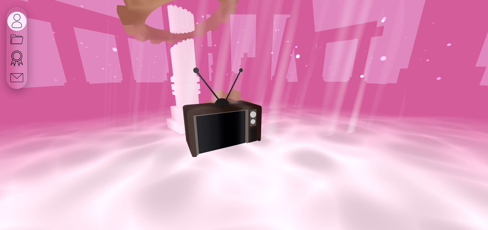

# 3D Portfolio

An interactive 3D personal portfolio built with React Three Fiber, Three.js, and GLSL shaders — hosted on AWS (S3 + CloudFront) and designed to showcase my projects, certificates, and experiences through immersive visuals and smooth interactions.

## Live Demo
[Visit the portfolio](https://brandonpratama.com)

---

## Tech Stack

- **Frontend:** React.js, Three.js, React Three Fiber, Tailwind CSS  
- **Graphics & Shaders:** GLSL, Drei, Framer Motion  
- **Design & Assets:** Figma, Blender  
- **Deployment:** AWS S3 + CloudFront (CDN), Vercel (build testing and previews)

---

##  Features

- Custom GLSL shaders for lighting, gradients, and interactive effects  
- Interactive 3D environment with smooth camera transitions   
- Dynamic project & certificate sections driven by structured data  
- Custom 3D models and lighting designed in Blender  
- Seamless navigation and timeline animations using GSAP

---

## Core Concepts

- **React Three Fiber** for declarative 3D scene management  
- **Custom GLSL shaders** for stylized materials, dynamic lighting, and post-processing effects  
- **Component-based architecture** for scalability and reusability  
- Focus on **visual storytelling** and **motion design**  

---

## Challenges & Solutions

| Challenge | Solution |
|------------|-----------|
| Realistic lighting and smooth 3D visuals | Implemented custom GLSL shaders with modular uniforms and reactive parameters |
| Maintaining design consistency across 3D scenes | Centralized scene management and shared lighting configuration |

---

## Preview

  

---

## 🧑‍💻 Author

**Brandon Pratama**  
- [Portfolio Website](https://brandonpratama.com)  
- [GitHub](https://github.com/Unnamedhat88)  
- Passionate about blending aesthetics, interactivity, and code through creative web technologies.

